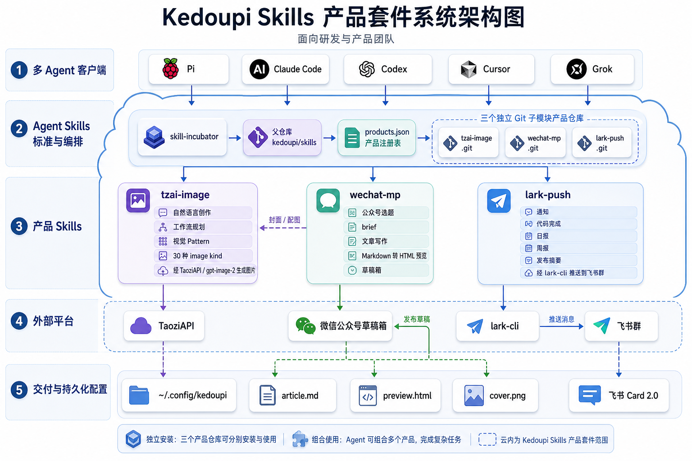

# Skills

Personal **agent skill incubator**: design, polish, and publish installable skills
for multi-agent use (`npx skills add`).

| Layer | GitHub | What lives there |
| --- | --- | --- |
| **Parent** | [kedoupi/skills](https://github.com/kedoupi/skills) | product registry, schema, template, meta skill, generated catalog, git submodules |
| **Product repo** | `kedoupi/<name>-skill` | one release unit: a single skill or a skill family under `skills/` |

```bash
# clone incubator + all product skills
git clone --recurse-submodules git@github.com:kedoupi/skills.git
# or later:
git submodule update --init --recursive
```

## Product architecture

The project-local [`skill-incubator`](./.agents/skills/skill-incubator/) manages the
parent registry and product submodules. Product skills can run independently or be
composed by an agent: `wechat-mp` can request visuals from `tzai-image`, while
`lark-push` delivers progress and completion notices to Feishu/Lark.

[](./docs/screenshots/skill-incubator/kedoupi-skills-architecture.png)

---

## Published skills（目录）

产品事实登记在 [`products.json`](./products.json)；下表由它和 primary `SKILL.md`
版本生成。不要手改表格行，运行 `bash scripts/render-catalog`。

<!-- BEGIN GENERATED PRODUCT CATALOG -->
| Skill product | Version | Type | 说明 | Repo | Install |
| --- | --- | --- | --- | --- | --- |
| **`lark-push`** | `1.5.0` | `single` | 飞书/Lark 群推送：完成通知、日报周报、发布摘要 | [kedoupi/lark-push-skill](https://github.com/kedoupi/lark-push-skill) | `npx skills add kedoupi/lark-push-skill` |
| **`tzai-image`** | `0.7.5` | `family` | TaoziAPI 创作 Agent：自然语言工作流、完整内容/视觉项目与安全生图引擎 | [kedoupi/tzai-image-skill](https://github.com/kedoupi/tzai-image-skill) | `npx skills add kedoupi/tzai-image-skill -g --all` |
| **`wechat-mp`** | `0.3.0` | `single` | 微信公众号：写作成稿 + 本地预览；可组合 tzai 配图 / lark 通知；可选草稿箱 | [kedoupi/wechat-mp-skill](https://github.com/kedoupi/wechat-mp-skill) | `npx skills add kedoupi/wechat-mp-skill` |
<!-- END GENERATED PRODUCT CATALOG -->

> **终端用户**：下面是「安装 → 配置 → 第一次用」。  
> **配置约定**：密钥写到 `~/.config/kedoupi/<skill>/config.env`（`init` 默认），**不要**只写在 skill 包目录或 `~/.zshrc`。  
> **安装 ≠ 配置**：`npx skills add` 只装代码；真正发消息 / 生图 / 推草稿前再 `init`。

### `lark-push`

- 用途：向配置好的飞书群发送进度/日报/发布类通知  
- 文档：[README](https://github.com/kedoupi/lark-push-skill#readme) · [中文](https://github.com/kedoupi/lark-push-skill/blob/main/README.zh-CN.md)

```bash
npx skills add kedoupi/lark-push-skill -g --all

SK=~/.agents/skills/lark-push
bash $SK/scripts/lark-push doctor
# 还需要：npm i -g @larksuite/cli  +  lark-cli 鉴权
bash $SK/scripts/lark-push init --chat-id 'oc_YOUR_CHAT_ID'
# → ~/.config/kedoupi/lark-push/config.env

bash $SK/scripts/lark-push --dry-run --kind notice --title "hello" --body "ok"
bash $SK/scripts/lark-push --kind notice --title "hello" --body "ok"
```

### `tzai-image`

- 用途：自然语言驱动的创作 Agent，经 [TaoziAPI](https://tzai.kdp.cool) 规划并生成单图或完整视觉项目；默认模型 **`gpt-image-2`**
- 形态：27 个结果型工作流 + 22 个视觉 Pattern + 30 个底层 kind；Plan C 斜杠保留为专家快捷入口
- 能力摘要：UI 流程、小红书/公众号内容包、文章配图、品牌、商品发布、Campaign、知识图、PPT、角色 IP，以及方案/首图两阶段确认
- 文档：[README](https://github.com/kedoupi/tzai-image-skill#readme) · [中文](https://github.com/kedoupi/tzai-image-skill/blob/main/README.zh-CN.md) · [场景表](https://github.com/kedoupi/tzai-image-skill/blob/main/docs/SCENES.md)

```bash
# 引擎 + 全部 Plan C skill → 各 Agent
npx skills add kedoupi/tzai-image-skill -g --all

E=~/.agents/skills/tzai-image/scripts/tzai-image
bash $E doctor
# Key：https://tzai.kdp.cool/console
bash $E init --api-key 'sk-YOUR_TOKEN'
# → ~/.config/kedoupi/tzai-image/config.env

bash $E icon --prompt "spark for AI coding app" --image ./icon.png

# 可选：把 commands/*.md 链到 Claude/Grok/Cursor 等 commands 目录
# git clone https://github.com/kedoupi/tzai-image-skill.git && cd tzai-image-skill
# bash scripts/install-slash-commands.sh
```

常用斜杠示例：`/tzai-image` `/tzai-xhs` `/tzai-xhs-cover` `/tzai-flowchart` `/tzai-architecture` `/tzai-icon` `/tzai-cover` …

### `wechat-mp`

- 用途：微信公众号成稿（任务书/审稿轨）+ 本地 HTML 预览；可选草稿箱  
- **套件组合**：单独可写；+ `tzai-image` 封面配图；+ `lark-push` 完成通知  
- 文档：[README](https://github.com/kedoupi/wechat-mp-skill#readme) · [中文](https://github.com/kedoupi/wechat-mp-skill/blob/main/README.zh-CN.md)

```bash
npx skills add kedoupi/wechat-mp-skill -g --all
# 常见组合：
# npx skills add kedoupi/tzai-image-skill -g --all
# npx skills add kedoupi/lark-push-skill -g --all

SK=~/.agents/skills/wechat-mp
bash $SK/scripts/wechat-mp doctor
bash $SK/scripts/wechat-mp init-style          # 可选文风
# 仅草稿箱需要：
# bash $SK/scripts/wechat-mp init --appid 'wx…' --secret '…'

# 在内容项目根目录：
bash $SK/scripts/wechat-mp new-out --title "选题"
bash $SK/scripts/wechat-mp preview --dir ./wechat-mp-out/<slug>
```

### 套件怎么拼（单独 / 组合）

| 你想做的事 | 建议安装 | 配置 |
| --- | --- | --- |
| 只生图 | `tzai-image` | `tzai-image init --api-key …` |
| 只飞书通知 | `lark-push` | `lark-cli` + `lark-push init --chat-id …` |
| 只写公众号文稿 | `wechat-mp` | 可不配；可选 `init-style` |
| 公众号 + 封面图 | `wechat-mp` + `tzai-image` | 生图需 tzai key |
| 成稿后飞书知会 | 再加 `lark-push` | 各自 `init` |
| 推微信草稿箱 | `wechat-mp` | `wechat-mp init --appid … --secret …` |

各 skill **单职责、密钥分治**；组合靠 Agent 编排与 `manifest.json` 交接，不硬捆绑安装。
---

## Naming

| | Pattern | Example |
| --- | --- | --- |
| Product / primary skill | `<name>` | `lark-push`, `tzai-image`, `wechat-mp` |
| Repo + directory | `<name>-skill` | `lark-push-skill`, `tzai-image-skill` |
| Product type | `single` or `family` | `tzai-image` is a family with 18 entrypoints |
| Install | `npx skills add kedoupi/<name>-skill` | |

## How this incubator works

```text
idea
  → skill-incubator (or agent) aligns scope
  → bash scripts/new-skill.sh <name>     # → ./<name>-skill/
  → implement + bash <name>-skill/tests/run.sh
  → create GitHub kedoupi/<name>-skill + push
  → bash scripts/register-submodule.sh <name>-skill
  → register product facts / entrypoints in products.json
  → bash scripts/render-catalog
  → commit parent: registry + generated catalog + submodule pointer
  → (optional) tag child vX.Y.Z + skills.sh
```

| Path | Role |
| --- | --- |
| [`products.json`](./products.json) | Product registry SoT (single/family, primary, entrypoints, install) |
| [`schema/products.schema.json`](./schema/products.schema.json) | Registry machine schema |
| [`schema/skill-repo.md`](./schema/skill-repo.md) | Living repo schema (layout, config, safety, tests) |
| [`_template/`](./_template/) | Single-product skeleton |
| [`scripts/new-skill.sh`](./scripts/new-skill.sh) | Scaffold `./<name>-skill/` |
| [`scripts/register-submodule.sh`](./scripts/register-submodule.sh) | `git submodule add` helper |
| [`scripts/list-skills`](./scripts/list-skills) | List product skill dirs / remotes |
| [`scripts/check-catalog`](./scripts/check-catalog) | Registry ↔ disk ↔ submodules ↔ generated views |
| [`scripts/render-catalog`](./scripts/render-catalog) | Generate README/AGENTS product tables |
| [`scripts/check-skill-layout`](./scripts/check-skill-layout) | `docs/` · `tests/` · `artifacts/` separation |
| [`scripts/doctor`](./scripts/doctor) | Incubator health (catalog + layout + …) |
| [`scripts/link-agent-skills`](./scripts/link-agent-skills) | Symlink meta skill for Claude/Grok |
| [`.agents/skills/skill-incubator/`](./.agents/skills/skill-incubator/) | Meta skill: create / edit / release |
| [`AGENTS.md`](./AGENTS.md) | Agent contract SoT |
| `<name>-skill/` | **Submodule** → product GitHub |

### Catalog maintenance（硬规范）

根目录 **`products.json`** 是产品目录 SoT；Published skills 是生成后的公开视图。
**新增产品、入口、用途变更** 时修改 registry；primary 版本从 `SKILL.md` 读取。

| 事件 | 必须更新 |
| --- | --- |
| 首次发布 / 首次挂 submodule | 增加 registry 产品、类型、入口、简介、install |
| 行为发版（version bump） | 更新 primary `SKILL.md`，family lockstep 入口同步版本 |
| 新增 / 删除 family 入口 | 更新 `entrypoints` |
| 下线 / 改名 | 更新 registry `status` 或对应产品 |

```bash
bash scripts/render-catalog       # products.json + SKILL.md → README / AGENTS
bash scripts/check-catalog        # registry ↔ packages ↔ .gitmodules ↔ generated views
bash scripts/check-skill-layout   # docs / tests / artifacts 分离
bash scripts/doctor               # 含 catalog + layout
```

流程：

1. Child: push + tag  
2. Parent: `git add <name>-skill`  
3. Parent: 必要时改 `products.json`；运行 `bash scripts/render-catalog`
4. `bash scripts/check-catalog` 通过
5. Parent: commit + push  

规范全文：[`schema/skill-repo.md`](./schema/skill-repo.md) § Product registry。

### Multi-agent notes

Keep **one** shared contract in `AGENTS.md`. Tool stubs only point at it.  
Each product submodule has its own `AGENTS.md` for skill-local rules.

### New skill

```bash
bash scripts/new-skill.sh my-feature
# creates my-feature-skill/ with skills/my-feature/
cd my-feature-skill
# edit package…
bash tests/run.sh
# create GitHub kedoupi/my-feature-skill, push, then from parent:
cd ..
bash scripts/register-submodule.sh my-feature-skill
# then add products.json entry, run scripts/render-catalog, and commit parent
```

### Schema evolution

1. Put references under `schema/references/<source>/`  
2. Log deltas in `schema/references/CHANGELOG.md`  
3. Promote rules into `schema/skill-repo.md` + `_template/`  

---

Each product is an independent public GitHub repository (submodule here), modeled as
either a single skill or a lockstep/independent skill family, following
[Agent Skills](https://agentskills.io/) and this incubator’s schema.
